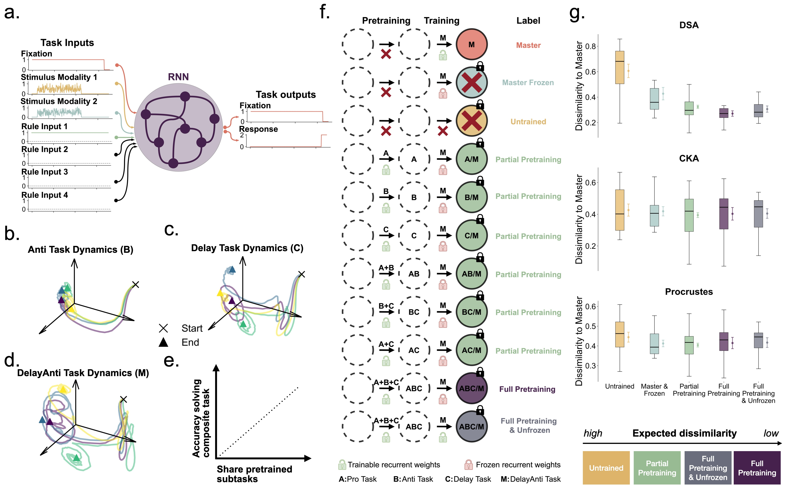

# DYNAMICAL SIMILARITY ANALYSIS UNIQUELY CAPTURES HOW COMPUTATIONS DEVELOP IN RNNS

Code accompanying the paper "DYNAMICAL SIMILARITY ANALYSIS UNIQUELY CAPTURES HOW COMPUTATIONS DEVELOP IN RNNS"

Methods for analyzing representations in neural systems have become a popular
tool in both neuroscience and mechanistic interpretability. Having measures to
compare how similar activations of neurons are across conditions, architectures,
and species, gives us a scalable way of learning how information is transformed
within different neural networks. In contrast to this trend, recent investigations
have revealed how some metrics can respond to spurious signals and hence give
misleading results. To identify the most reliable metric and understand how mea-
sures could be improved, it is going to be important to identify specific test cases
which can serve as benchmarks. Here we propose that the phenomena of compo-
sitional learning in recurrent neural networks (RNNs) would allow us to build a
test case for dynamical representation alignment metrics. By implementing this
case, we show it allows us to test whether metrics can identify representations
which gradually develop throughout learning and probe whether representations
identified by metrics are relevant to the actual computations executed within the
network. By building both an attractor- and RNN-based test case, we can show
that the recently proposed Dynamical Similarity Analysis (DSA) is more noise ro-
bust and identifies behaviorally relevant representations significantly more reliably
than prior metrics (Procrustes, CKA). We also show how such test cases can be
used beyond evaluating metrics to study new architectures directly. Specifically,
we tested DSA in modern (Mamba) state space models, where results suggest that,
in contrast to RNNs, these models may not exhibit or require changes in their re-
current dynamics due to their expressive hidden state. Overall, we develop test
cases that can demonstrate how DSA’s increased ability to detect dynamical mo-
tifs gives it a superior ability to identify the ongoing computations in RNNs and
elucidate how tasks are learned in networks.

Code Author: Quentin Guilhot

## How to install

- create new environment : conda create -n repal3 python=3.11.9
- activate environment : conda activate repal3
- install dependencies : pip install -r requirements.txt
- create folders for models, data : mkdir models data

## How to use

The code is mainly divided into 2 parts:

### 1 : Simulations

Use 3D attractor dynamics to show if RepAL metrics are relevant to capture compositional problem solving and compositional learning. 

####  Code Structure
- dsa_analysis : Folder containing the code to compute the dynamical similarity between the models
- notebooks/nalysis_lorenz_{x}.ipynb : Test cases for RepAL metrics to assess ratio-like behavior and noise-robustness

#### How to use
- change parameters in the config.yaml file (DSA parameters and simulations parameters)
- run notebook of your choice

### 2 : Application to RNN models trained on neurotasks

Use the validated metrics to apply them to a known case of compositional learning and problem solving in Recurrent Neural Networks (RNNs) trained on a set of neurotasks

#### Code Structure
- main: Folder containing the code to train the models on the neurotasks
- notebooks/analysis_rnn_{x}.ipynb : Analysis of the activity and representation of the models corresponding to paper figures
- sbatch: Folder containing the scripts to run the training on the cluster
- config.yaml : Configuration file for the training
- src: Folder containing the code to train the models and analyze the results

#### How to use (in order of execution)
- generate the data: sbatch sbatch/generate_data.sh
- train the models: sbatch sbatch/train_PDM.sh
- compute dissimilarity of computational dynamics of models: sbatch sbatch/dissimilarity_PDM.sh
- compute dissimilarities of learning dynamics of models: sbatch sbatch/dissimilarity_over_learning_PDM.sh
- analysis of the results: notebooks/analysis_rnn_{x}.ipynb

### 3 : Application to Mamba models trained on neurotasks

Use the validated metrics to apply them to a known case of compositional learning and problem solving but this time on State Space Models (SSMs) Mamba trained on a set of neurotasks

#### Code Structure
- main: Folder containing the code to train the models on the neurotasks
- notebooks/analysis_mamba.ipynb : Analysis of the activity and representation of the models corresponding to paper figures
- sbatch: Folder containing the scripts to run the training on the cluster
- config.yaml : Configuration file for the training
- src: Folder containing the code to train the models and analyze the results

#### How to use (in order of execution)
- generate the data: sbatch sbatch/generate_data.sh
- train the models: sbatch sbatch/train_mamba_PDM.sh
- compute dissimilarity of computational dynamics of models: sbatch sbatch/dissimilarity_mamba_PDM.sh
- compute dissimilarities of learning dynamics of models: sbatch sbatch/dissimilarity_over_learning_mamba_PDM.sh
- analysis of the results: notebooks/analysis_mamba.ipynb

## References

- Mitchell Ostrow, Adam Eisen, Leo Kozachkov, Ila Fiete, "Beyond Geometry: Comparing the Temporal Structure of Computation in Neural Circuits with Dynamical Similarity Analysis", 	https://arxiv.org/abs/2306.10168
- Yang, G.R., Joglekar, M.R., Song, H.F. et al. Task representations in neural networks trained to perform many cognitive tasks. Nat Neurosci 22, 297–306 (2019). https://doi.org/10.1038/s41593-018-0310-2
- Sugandha Sharma, Fernanda De La Torre, "MIT/Harvard Computational & Theoretical Neuroscience Journal Club", https://compneurojc.github.io/index.html 
- Laura Driscoll, Krischna Shenoy, David Sussillo, "Flexible multitask computation in recurrent networks utilizes shared dynamical motifs", https://www.biorxiv.org/content/10.1101/2022.08.15.503870v1
- lia Sucholutsky, Lukas Muttenthaler, Adrian Weller, Andi Peng, Andreea Bobu, Been Kim, Bradley C. Love, Erin Grant, Iris Groen, Jascha Achterberg, Joshua B. Tenenbaum, Katherine M. Collins, Katherine L. Hermann, Kerem Oktar, Klaus Greff, Martin N. Hebart, Nori Jacoby, Qiuyi Zhang, Raja Marjieh, Robert Geirhos, Sherol Chen, Simon Kornblith, Sunayana Rane, Talia Konkle, Thomas P. O'Connell, Thomas Unterthiner, Andrew K. Lampinen, Klaus-Robert Müller, Mariya Toneva, Thomas L. Griffiths, "Getting aligned on representational alignment", https://arxiv.org/abs/2310.13018
- Nathan Cloos, Markus Siegel, Scott L. Brincat, Earl K. Miller, Christopher J Cueva, "Differentiable Optimization of Similarity Scores Between Models and Brains", https://openreview.net/forum?id=C0G0mQp92K
- Stefano Sarao Mannelli, Yaraslau Ivashinka, Andrew Saxe, Luca Saglietti, "Tilting the Odds at the Lottery:
the Interplay of Overparameterisation and Curricula in Neural Networks", https://arxiv.org/abs/2406.01589
- Manuel Molano-Mazón, Joao Barbosa, Jordi Pastor-Ciurana, Marta Fradera, RU-YUAN ZHANG, Jeremy Forest, Jorge del Pozo Lerida, Li Ji-An, Christopher J Cueva, Jaime de la Rocha, Devika Narain, and Guangyu Robert Yang, "NeuroGym: An open resource for developing and sharing neuroscience tasks", https://osf.io/preprints/psyarxiv/aqc9n